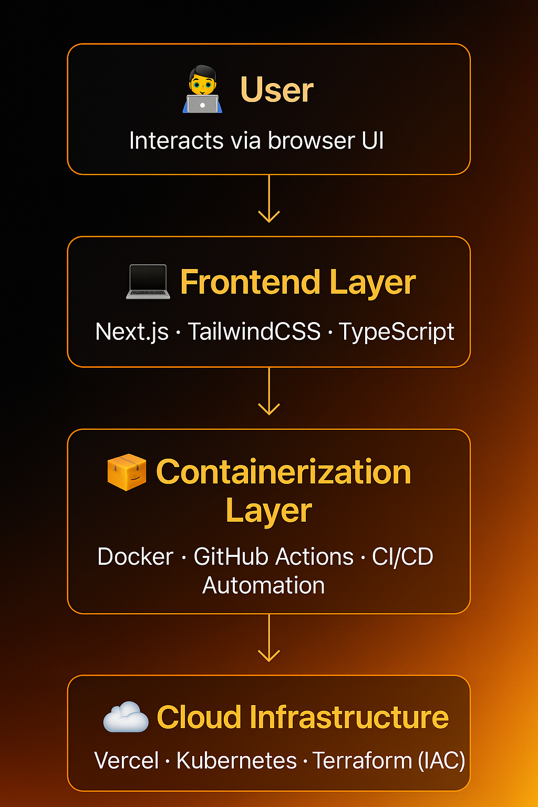

# 🌌 Aurora UI — Ember Edition  
**Created by [Kiara McRae](https://www.linkedin.com/in/kiara-mcraetopperformer)**  
> _A full-stack, cloud-native showcase blending UX, engineering, and automation into one glowing ecosystem._


---

## ✨ Overview
**Aurora UI** merges design systems, automation, and scalable deployment into one immersive experience.  
It demonstrates technical and creative mastery across **frontend development**, **UX**, and **DevOps** — built entirely by Kiara McRae.

> “Where ember meets code — sleek gradients, motion, and music collide.”

---

## 🧩 Core Features

| Category | Description |
|---|---|
| 🎨 **Design System** | TailwindCSS gradient + motion components for consistent visuals |
| ⚡ **True Shuffle** | Fisher–Yates algorithm for unbiased random playback |
| 💌 **Email & Marketing Experience** | WCAG-compliant responsive templates (Litmus / Email on Acid tested) |
| 🧠 **Automation Ready** | GitHub Actions pipelines and Terraform-ready infrastructure |
| 📊 **Aurora Cloud Dashboard v2** | Recharts analytics with adaptive theming |
| 🪄 **Accessibility** | WCAG 2.1, ARIA patterns, ADA awareness |
| ☁️ **Containerization** | Docker build → Vercel deploy (Kubernetes-ready configs) |

---

## 🧠 Aurora Architecture Diagram

> A visual of how Aurora connects **design → code → cloud**.



### DevOps Flow (Mermaid)

> GitHub renders this if “**Allow Mermaid**” is enabled in repo settings.  
> (We avoid slashes and special symbols in labels to keep GitHub’s parser happy.)

```mermaid
flowchart LR
  A[Frontend - Next.js 15 + TailwindCSS] --> B[Docker Container]
  B --> C[GitHub Actions CI-CD]
  C --> D[Vercel Deployment]
  D --> E[Kubernetes and Terraform Ready]
